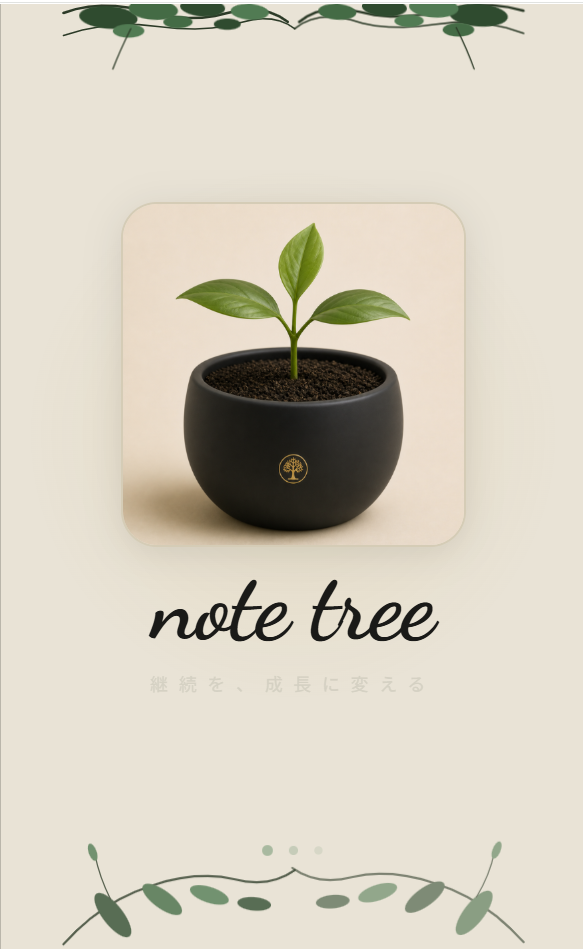
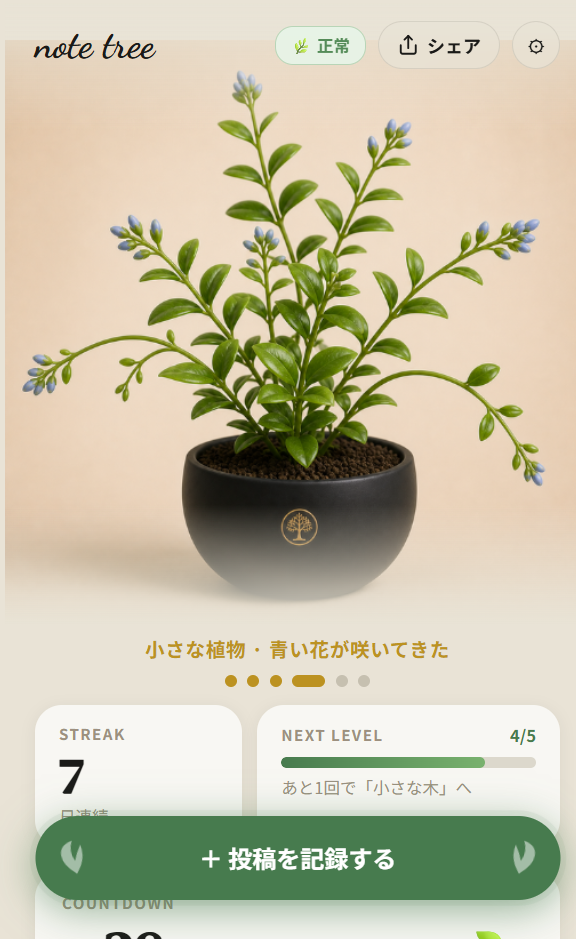

# note tree 🌱

**Turn consistency into growth** — A web app that motivates note creators by visualizing their posting streak as a growing plant avatar.

---

## Screenshots

<div align="center">
  
  &nbsp;&nbsp;
  
</div>

> Left: Splash screen　Right: Home screen showing avatar at stage 4 (STREAK 7, one post away from the next stage)

---

## Overview

Every time you post an article on [note](https://note.com), your in-app plant avatar grows.  
By turning consistency into the experience of *raising a plant*, the app naturally motivates you to write just one more article.

| Stage | Status |
|-------|--------|
| 🌰 Seed | Nothing has started yet |
| 🌱 Sprout | First signs of life |
| 🍃 Sapling | Growing steadily |
| 🌸 Small plant | Blue flowers are blooming |
| 🌳 Small tree | Feeling established |
| 🌲 Great tree (Wisteria) | A magnificent wisteria! |

Miss a post and your plant takes damage. Keep posting and it thrives.

---

## Features

- **Avatar growth visualization** — 12 unique plant images: 6 stages × healthy / damaged states
- **Streak tracking** — Consecutive post count with progress bar to the next level
- **Course setup** — Choose 1-month or 3-month courses with custom posting frequency
- **OGP preview** — Paste a note URL to auto-fetch the article thumbnail and title
- **Post history** — Browse past posts in a card feed
- **Web Push notifications** — Reminder notifications so you never miss a posting day
- **Social sharing** — Share your current growth stage with an image
- **Guest mode** — Try the app without creating an account

---

## Tech Stack

| Category | Technology |
|----------|-----------|
| Frontend | Next.js 16 (App Router) / React 19 / TypeScript |
| Styling | Tailwind CSS v4 / CSS Modules |
| Auth | NextAuth v4 + Amazon Cognito |
| Backend | AWS API Gateway + AWS Lambda (serverless) |
| Notifications | Web Push API (VAPID) |
| Hosting | Vercel |

---

## Getting Started

### Install dependencies

```bash
npm install
```

### Configure environment variables

```bash
cp .env.example .env.local
```

Fill `.env.local` with the following values:

| Variable | Required | Description |
|----------|----------|-------------|
| `NEXT_PUBLIC_API_URL` | ✅ | API Gateway base URL (no trailing slash) |
| `NEXT_PUBLIC_VAPID_PUBLIC_KEY` | ✅ | VAPID public key for Web Push |
| `NEXTAUTH_URL` | ✅ | App URL (`http://localhost:3000` locally) |
| `NEXTAUTH_SECRET` | ✅ | Random secret for NextAuth session/JWT signing |
| `GUEST_JWT_SECRET` | Guest mode only | Secret for signing guest JWTs — must match the backend value |
| `COGNITO_CLIENT_ID` | ✅ | Amazon Cognito app client ID |
| `COGNITO_CLIENT_SECRET` | ✅ | Amazon Cognito app client secret |

### Start the development server

```bash
npm run dev
```

Open [http://localhost:3000](http://localhost:3000).

---

## Useful Commands

```bash
npm run dev      # Start development server
npm run build    # Production build
npm run lint     # Run ESLint
npx tsc --noEmit # Type check
```

---

## Security Notes

- Do **not** commit `.env.local`, `.env.production`, or `.vercel` (already in `.gitignore`)
- Variables prefixed with `NEXT_PUBLIC_` are bundled for the browser — never put private secrets there
- `GUEST_JWT_SECRET` must be identical between the frontend and the deployed Lambda backend
- If a secret was ever committed or shared, rotate it before making the repository public

---

## 日本語 README

👉 [README.md](./README.md)

---

## License

MIT
